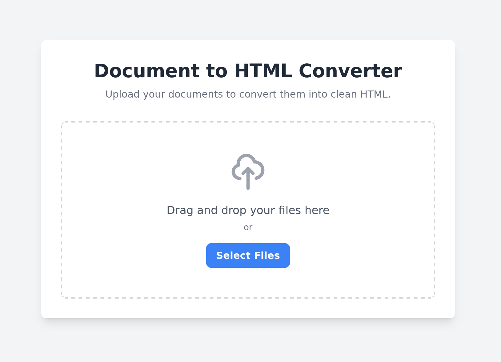

# DOCOVERT

> [!WARNING]  
> This project was 100% vide-coded and not suitable for production.

A simple web application to convert one or more .docx files into self-contained HTML files, with all images embedded directly into the document. The resulting files are bundled into a single .zip archive for easy download.



## Features

- **Drag-and-Drop Interface**: Easily add files by dragging them onto the upload area.
- **Multiple File Uploads**: Select and convert multiple .docx files at once.
- Secure Backend Conversion: Uses the powerful Pandoc engine in a secure, isolated process.
- **Self-Contained HTML**: All images from the document are embedded as Base64 data directly into the HTML file, ensuring there are no broken links.
- **Zipped Archive**: The converted HTML files are delivered in a single, convenient .zip archive.
- **Clean & Responsive UI**: Built with Tailwind CSS for a modern look on any device.

## Core Technologies

- **Backend**: Flask (Python)
- **Frontend**: HTML, Tailwind CSS, Vanilla JavaScript
- **Conversion Engine**: Pandoc

## Prerequisites
Before you begin, you must have the following installed on your system:

- Python 3.8+
- uv
- Pandoc

## Setup and Installation

Follow these steps to get the application running locally using uv.

1. Clone the Repository

```sh      
git clone https://noahhefner/docovert.git
cd docovert
```
    
2. Install Dependencies with uv

Use uv to install the required dependencies:

```sh      
uv sync
```

3. Run the Application

```sh
.venv/bin/flask --app main run
```
    
4. Access the Web App

Open your web browser and navigate to `http://127.0.0.1:5000`.

## Future Improvements

- Support for more input formats (e.g., .md, .rtf, .odt).
- Add a real-time progress bar for uploads and conversions.
- If only one file is converted, download it directly as .html instead of a .zip.
- Add deployment instructions (e.g., using Gunicorn and Nginx).