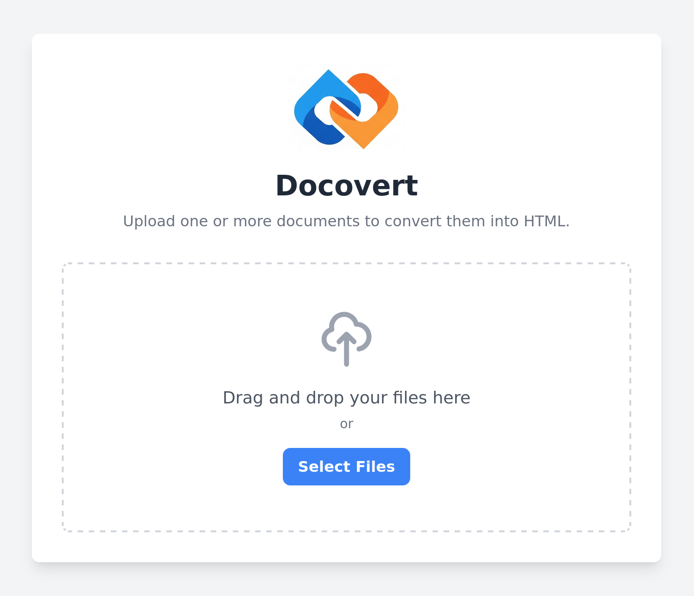

<p align="center">
  
</p>
      
<h1 align="center">Docovert</h1>

<p align="center">
  
  
  
  
  
</p>

A flexible web application to convert documents between multiple formats. Upload files in any of 50+ supported input formats and convert them to your choice of 11 output formats. All images are embedded directly into the output documents (for supported formats), and the resulting files are bundled into a single .zip archive for easy download.

> [!WARNING]  
> This project is mostly vibe-coded and not suitable for production.



## Features

- **Drag-and-Drop Interface**: Easily add files by dragging them onto the upload area.
- **Multiple File Uploads**: Select and convert multiple files at once.
- **Flexible Output Formats**: Choose your desired output format from 11 supported options.
- **Self-Contained Output**: For HTML, PDF, and EPUB formats, all images are embedded directly into the output document.
- **Format Support**: Convert between 50+ input formats and 11 output formats.
- **Zipped Archive**: The converted files are delivered in a single, convenient `.zip` archive.
- **Clean & Responsive UI**: Built with Tailwind CSS for a modern look.

## Core Technologies

- **Backend**: Flask (Python)
- **Frontend**: HTML, Tailwind CSS, Vanilla JavaScript
- **Conversion Engine**: Pandoc

## Supported Output Formats

Docovert can convert to the following output formats:

| Format | Extension | Description |
|--------|-----------|-------------|
| HTML | `.html` | Web format with embedded resources |
| Markdown | `.md` | Lightweight markup language |
| Word Document | `.docx` | Microsoft Word format |
| OpenDocument Text | `.odt` | LibreOffice/OpenOffice format |
| reStructuredText | `.rst` | Python documentation standard |
| LaTeX | `.tex` | Professional typesetting format |
| Rich Text Format | `.rtf` | Text format with basic formatting |
| E-book (EPUB) | `.epub` | E-book standard with embedded resources |
| PDF | `.pdf` | Portable document format with embedded resources |
| Plain Text | `.txt` | Simple unformatted text |
| JSON | `.json` | JSON data format |

## Supported Input File Formats

Using Pandoc 3.8, the supported input file formats are:

```plaintext
biblatex
bibtex
bits
commonmark
commonmark_x
creole
csljson
csv
djot
docbook
docx
dokuwiki
endnotexml
epub
fb2
gfm
haddock
html
ipynb
jats
jira
json
latex
man
markdown
markdown_github
markdown_mmd
markdown_phpextra
markdown_strict
mdoc
mediawiki
muse
native
odt
opml
org
pod
ris
rst
rtf
t2t
textile
tikiwiki
tsv
twiki
typst
vimwiki
xml
```

## Prerequisites

Ensure the following tools are installed:

- Python 3.12+
- uv
- Pandoc
- make
- node

Optional:

- Docker

## Setup and Installation

Follow these steps to get the application running locally.

1. Clone the Repository

```sh
git clone https://noahhefner/docovert.git
cd docovert
```

2. Install dependencies

```sh
make setup
```

3. Run the Application

```sh
make run
```

4. Access the Web App

Navigate to `http://localhost:5000` in a web browser.

## Run With Docker

1. Build the Docker image

```sh
make build
```

2. Run the image

```sh
make run-docker
```

3. Access the Web App

Navigate to `http://localhost:8080` in a web browser.

## Run Tests

Pytest is used for testing. Run the tests with:

```sh
make test
```

## Code Formatting

Format code with the `format` target:

```sh
make format
```

## Future Improvements

- Add tests for converting all file types
- Add a real-time progress bar for uploads and conversions.
- If only one file is converted, download it directly as the output format instead of a `.zip`.
- Add support for custom conversion options (e.g., CSS styling for HTML output, page size for PDF).
- Implement file size limits and timeout handling for large conversions.
