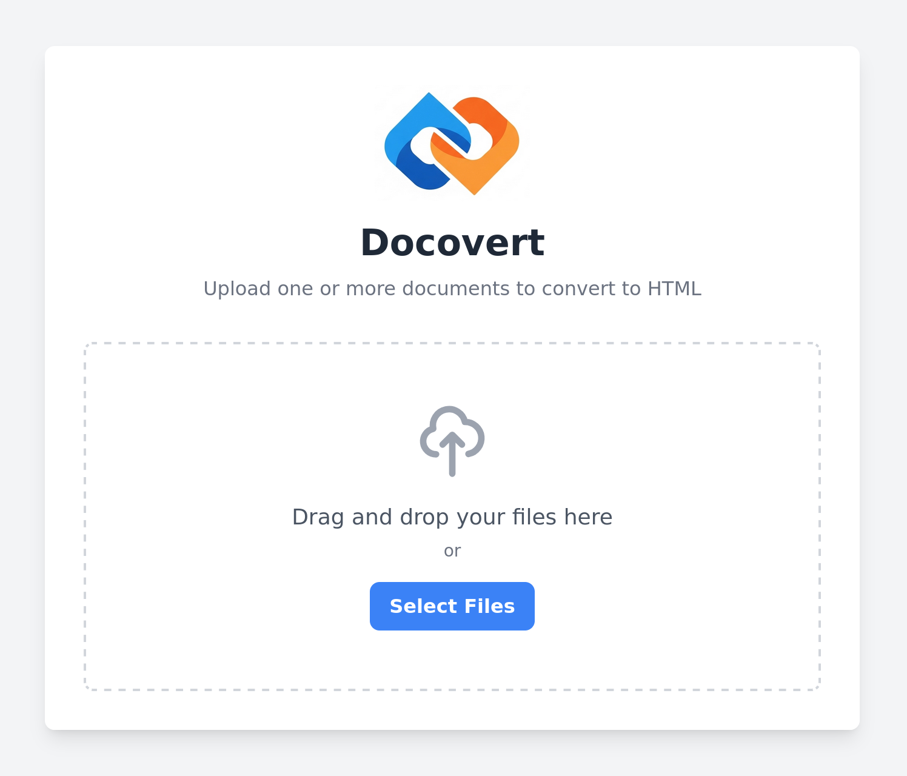

<p align="center">
  
</p>
      
<h1 align="center">Docovert</h1>

<p align="center">
  
  
  
  
  
</p>

A simple web application to convert one or more files into self-contained HTML files, with all images embedded directly into the document. The resulting files are bundled into a single .zip archive for easy download.

> [!WARNING]  
> This project is 100% vide-coded and not suitable for production.



## Features

- **Drag-and-Drop Interface**: Easily add files by dragging them onto the upload area.
- **Multiple File Uploads**: Select and convert multiple files at once.
- **Self-Contained HTML**: All images from the document are embedded as Base64 data directly into the HTML file.
- **Zipped Archive**: The converted HTML files are delivered in a single, convenient `.zip` archive.
- **Clean & Responsive UI**: Built with Tailwind CSS for a modern look.

## Core Technologies

- **Backend**: Flask (Python)
- **Frontend**: HTML, Tailwind CSS, Vanilla JavaScript
- **Conversion Engine**: Pandoc

## Supported Input File Formats

Using Pandoc 3.8, the supported input file formats are:

```plaintext
biblatex
bibtex
bits
commonmark
commonmark_x
creole
csljson
csv
djot
docbook
docx
dokuwiki
endnotexml
epub
fb2
gfm
haddock
html
ipynb
jats
jira
json
latex
man
markdown
markdown_github
markdown_mmd
markdown_phpextra
markdown_strict
mdoc
mediawiki
muse
native
odt
opml
org
pod
ris
rst
rtf
t2t
textile
tikiwiki
tsv
twiki
typst
vimwiki
xml
```

## Prerequisites

Ensure the following tools are installed:

- Python 3.12+
- uv
- Pandoc
- make
- node

## Setup and Installation

Follow these steps to get the application running locally.

1. Clone the Repository

```sh
git clone https://noahhefner/docovert.git
cd docovert
```

2. Install dependencies

```sh
make setup
```

3. Run the Application

```sh
make run
```

4. Access the Web App

Navigate to `http://localhost:5000` in a web browser.

## Run With Docker

1. Build the Docker image

```sh
make build
```

2. Run the image

```sh
make run-docker
```

3. Access the Web App

Navigate to `http://localhost:8080` in a web browser.

## Code Formatting

Format code with the `format` target:

```sh
make format
```

## Future Improvements

- Add tests for converting all file types
- Add a real-time progress bar for uploads and conversions.
- If only one file is converted, download it directly as `.html` instead of a `.zip`.
